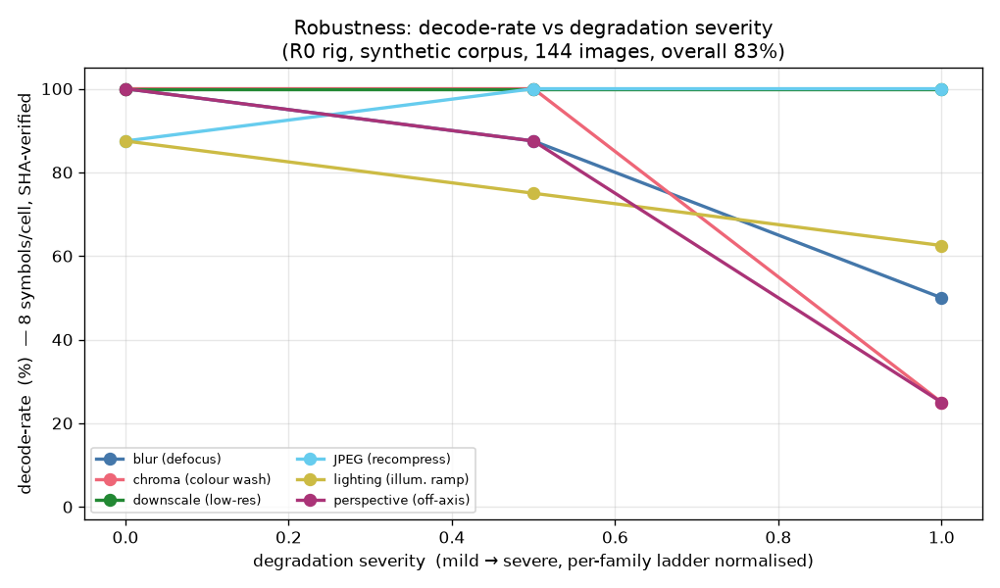
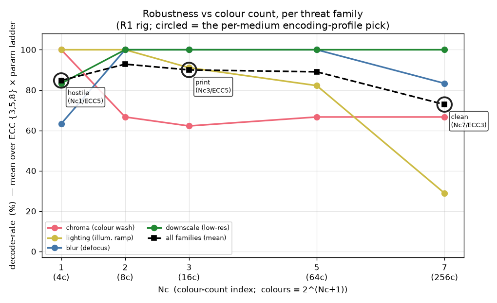
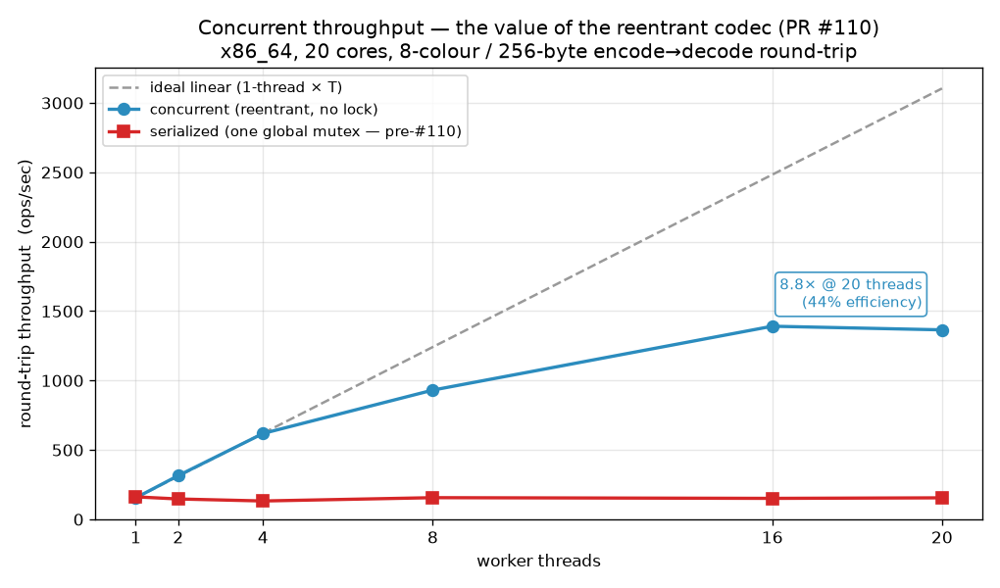
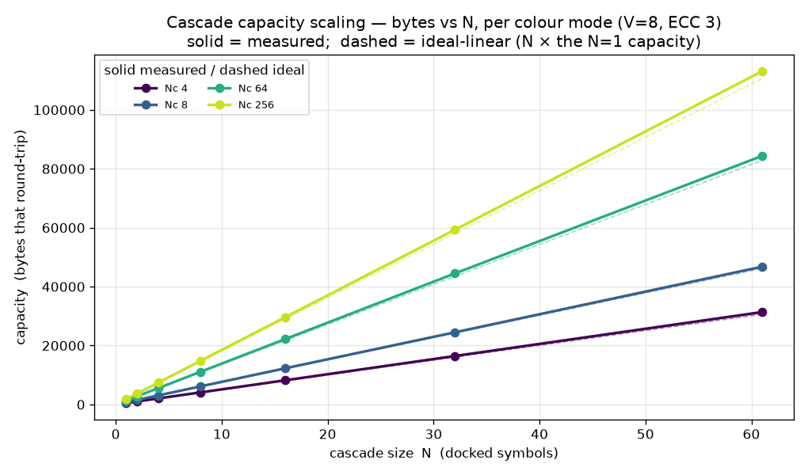
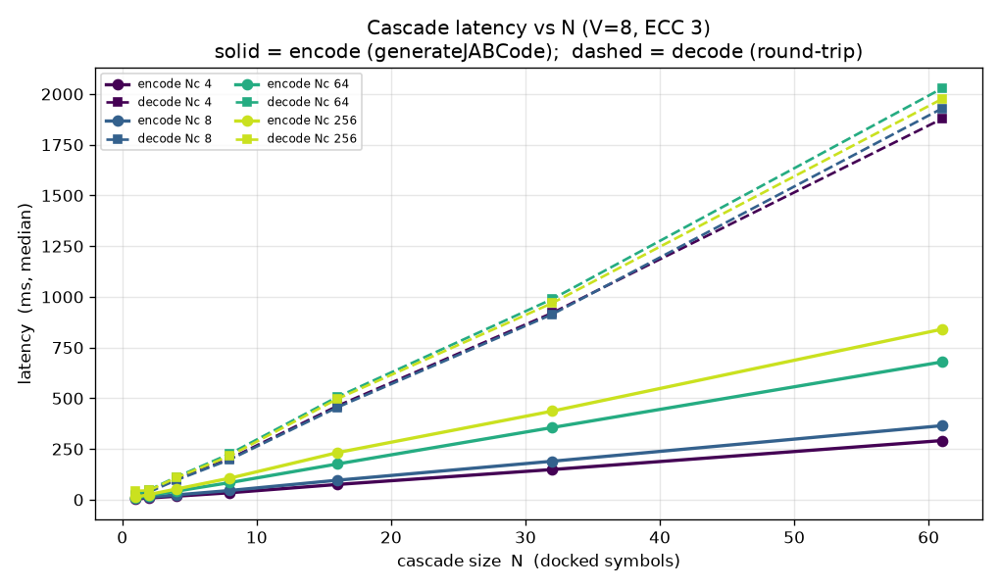
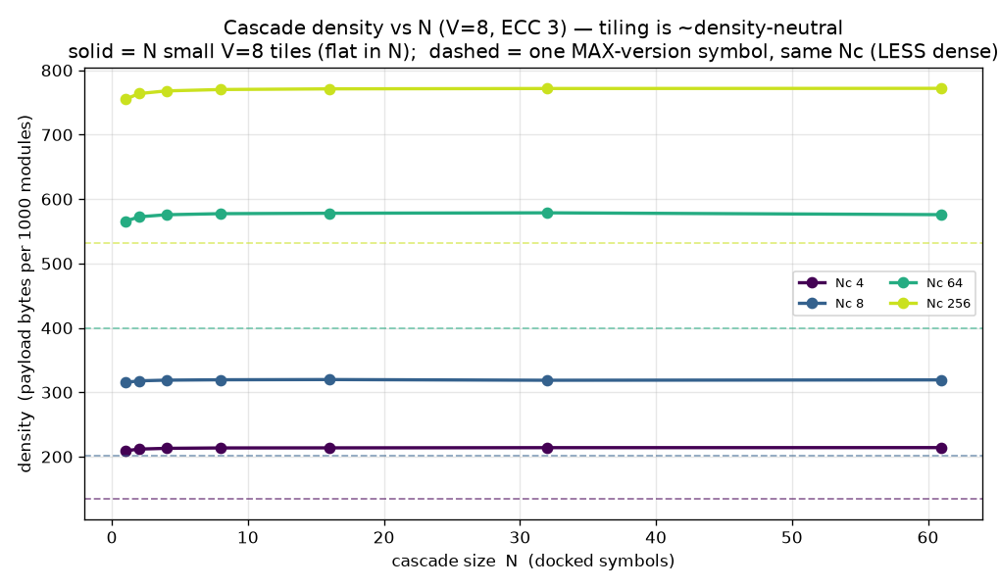
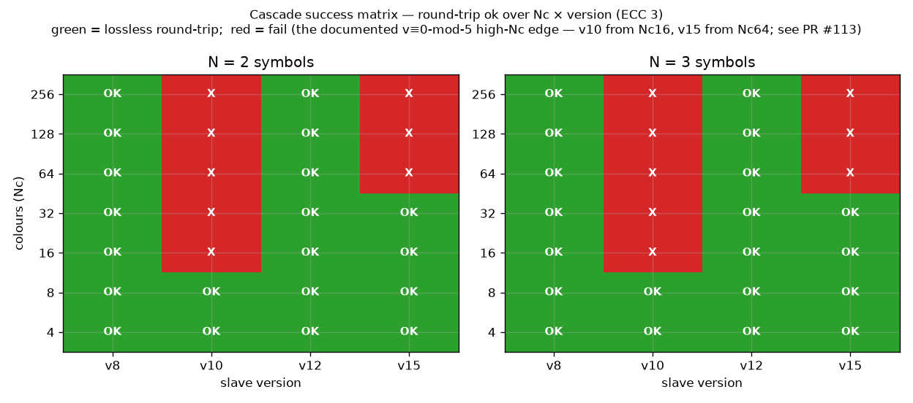

# JABCode codec benchmarks — the full picture

A measured-from-source view of the JABCode codec across the axes that matter:
**capacity, latency, the ECC tradeoff, transcode robustness, and capture
robustness** — plus a scaffold for the end-to-end verification budget. **Refreshed
on the optimized decoder** (the JABCode latency campaign, jabcode PRs through #91:
the ~19.6× encode speedup + decode/binarize work). The encode/decode latency here
is the *post-optimization* picture; capacity and transcode-survival are byte-identical
to the pre-optimization baseline (the opts were behaviour-preserving), as expected.

## What is measured vs. scaffolded

| Source | Charts | Status |
|---|---|---|
| `bench_sweep` (C, host x86_64, links libjabcode) | capacity heatmap, text-vs-binary, latency, ECC Pareto, Wikipedia, density | **measured** |
| `transcode_survival.py` (C encode → PIL transform → C decode) | transcode-survival heatmap | **measured** (digital channel, 1 trial/cell) |
| **R0 rig** (`robustness/r0`, C `r0_decode` probe + synthetic corpus) | **decode-rate vs degradation** | **measured** (8 symbols/cell, SHA-verified) |
| **R1 rig** (`robustness/r1-profiles`, R0 rig over an Nc×ECC grid) | **robustness vs Nc + per-medium profiles** | **measured** (5 payloads/cell, SHA-verified) |
| `bench_cascade` (C, host x86_64, links libjabcode) | cascade capacity / latency / density vs N + success matrix | **measured** (multi-symbol, round-trip-verified; the axis PR #113 made sound) |
| representative crypto timings | verification budget | **scaffold** — decode is measured, PKI/ABE/JWT are placeholders pending the `jab-auth` module benchmarks |

Reproduce the codec suite: `make -C src/jabcode sweep transcode`, run
`build/bench_sweep fixtures/wikipedia_qr.txt | grep '^{' > data/sweep.jsonl` (the `grep` drops the encoder's "Message does not fit" notices, which it prints to stdout during the capacity sweep) and
`python benchmarks/transcode_survival.py`, then `python benchmarks/gen_charts.py`.
The robustness panel additionally needs the R0 rig run before `gen_charts.py`
(see §7). Fixtures: `fixtures/wikipedia_qr.txt` (the Wikipedia *QR code* article,
~7.6 KB, the text-capacity stress payload). Raw data: `data/*.jsonl`.

---

## 1 · Capacity — the surface

Single-symbol **text** capacity across the two knobs that set it: colour mode (Nc)
and ECC level. This is the canonical heatmap use-case — a *decision surface*. A brand
that needs "2 KB of provenance text surviving ECC level 5" reads off the cell.

**The headline:** a single 256-colour JABCode holds **~12.6 KB** (binary) / **~12.8 KB**
(text) at ECC 1, falling to **~2.9 KB** at ECC 10. Text beats binary at every cell —
the mode-compression of the (now fully ISO-conformant) text encoder packing letters at
~5 bits vs 8 bits/byte.

### The Wikipedia article test

The **entire 7,637-byte Wikipedia QR-code article fits in ONE 64-colour JABCode** (100%),
and the symbol keeps shrinking with more colours (145 → 121 modules at 256-colour). At
8-colour, 58% of the article fits in a single symbol. This doubles as a large-scale
**conformance** test — the article round-trips byte-identical through the text modes.

### Density vs QR

QR's maximum is **2,953 bytes** (binary, version 40, ECC level L — per the article itself).
A single JABCode passes that at modest colour depth and reaches ~4× it at 256-colour —
the polychrome density advantage, quantified.

---

## 2 · Latency

Encode and decode median latency by colour mode (256 B, ECC 3, x86_64 host), on the
**optimized decoder**. Decode still dominates (the LDPC + colour classification), but
after the latency campaign encode is **flat ~3–5 ms** across every colour mode and the
old "cost rises monotonically with colour depth" shape is gone — decode is now in a
tight ~6–17 ms band with no clean Nc trend at this payload.

Decode latency vs payload size — the scaling the fixed-payload bench couldn't show.
(2-colour / Nc0 decode is unreliable on host beyond tiny payloads — a known pre-existing
Mode-0 limitation, surfaced honestly here as `dec_ok=0`.)

---

## 3 · The ECC tradeoff

The robustness-vs-everything-else curve (8-colour), on the **optimized decoder**.
Climbing ECC 1→10 trades capacity (~4.8 KB → ~1.1 KB at this payload) **and** decode
latency (**~8 ms → ~97 ms**, down from ~9→151 ms pre-optimization) for error resilience.
*Encode no longer pays for ECC* — it stays flat ~3–6 ms across the whole range, so the
ECC trade now lives entirely on the decode + capacity axes. The default level 3 sits
where the curve is still cheap — the right knee for the print-vs-screen two-medium posture.

---

## 4 · Transcode robustness (digital channel)

Decode survival after real digital transforms (JPEG recompress, downscale, 4:2:0 chroma)
applied via PIL, at module size 12 px. The honest result: **JABCode is robust** to
ordinary distribution transcoding across most colour modes; the failure modes are
**aggressive downscale** (sub-~4 px/module breaks even low-Nc) and **heavy JPEG on the
highest colour density** (256-colour fails q30, where colour quantization collapses the
palette). This is the *digital* channel — distinct from, and complementary to, the
optical/camera channel that the dedicated C2PA transcode-survival spike owns.

---

## 5 · End-to-end verification budget (scaffold)

The strategic headline metric — does the SDK keep its "sub-100 ms verification" promise
(ecosystem report Opp 30)? **Decode is measured**; the PKI-verify / CP-ABE-decrypt /
JWT-validate stages are **placeholders** pending wiring of the `jab-auth` crypto module
benchmarks. The frame is the deliverable: a per-component budget against the 100 ms line,
ready to be filled with real `jab-auth-pki/abe/jwt` numbers.

---

## 6 · Comparative — JABCode vs QR (zxing-cpp)

A head-to-head against the incumbent, measured the same way: QR generated with `segno`,
decoded and timed with **zxing-cpp** (the actual library), same payloads, same PIL
transcode transforms. Deliberately honest — it shows where JABCode **loses**.

| Axis | QR (zxing-cpp) | JABCode | Winner |
|---|---|---|---|
| **Density** (max 1 symbol) | 2,953 B (ECC-L) | 11,193 B (Nc256, ECC3) / 12,594 B (ECC1) | **JABCode ~4×** |
| **Decode latency** (64 B) | 0.22 ms | 2.33 ms (8-colour) | **QR ~10×** |
| **Transcode-survival** | survives all transforms | cliffs at aggressive downscale / high-Nc heavy JPEG | **QR** |

**The honest read:** JABCode owns **density** — and the axis no monochrome code can
touch: multi-layer CP-ABE, crypto-bound, offline-verifiable payload. QR owns **speed,
robustness, and ubiquity**. JABCode is not a "faster, tougher QR"; it is the
*high-density, multi-layer, cryptographic* option, and the data says so plainly.

**A second reveal:** part of QR's latency/robustness lead is **reader maturity** —
zxing-cpp is a decade-hardened, sub-pixel-tolerant C++ reader, while the JABCode
reference decoder is research-grade C. That is exactly the gap a **JABCode port into
zxing-cpp** would close — making this comparison itself an argument for the collaboration.

---

## 7 · Capture robustness — the axis the rest of the suite lacked

Capacity, latency, ECC, and *digital* transcode-survival all assume the symbol
reaches the decoder roughly intact. The missing axis is **what survives real
capture degradation** — defocus, off-axis perspective, illumination ramps, screen
colour-wash, low-res sensors, recompression. The R0/R1 rigs measure exactly that,
decode-rate with **known-payload SHA-256 verification** (a decode counts only if the
bytes are *correct*, so a lucky-looking-but-wrong decode never scores).

### Decode-rate vs degradation severity

The **R0 rig** over the synthetic corpus (144 images = 8 colour modes × 6
degradation families × a per-family severity ladder, 8 symbols/cell). Overall
**82.6 %**. The shape is the point: **downscale and JPEG-recompress hold ~100 %**
across the whole ladder (the codec is robust to ordinary distribution transforms,
echoing §4), while **chroma (colour-wash) and off-axis perspective cliff hard** at
the worst rung (→25 %), **blur** falls to 50 %, and the **illumination ramp**
degrades gracefully to ~62 %. These are the *capture* failure modes a camera SDK
must design around — invisible to every other chart in this suite.

### Robustness vs colour count, with the per-medium profile picks

The **R1 rig** sweeps the degradation families across an Nc×ECC grid (5
payloads/cell, SHA-verified) and asks *which colour count is most robust*. The
all-families mean is an **inverted-U peaking at Nc2–3 (8–16 colours) and collapsing
at Nc7 (256 colours)** — more colours pack more data but sit closer together, so a
colour-wash or illumination ramp folds them into each other. The per-family split
is sharper still: **chroma and lighting strongly favour low Nc** (Nc1 = 100 % on
both), while **downscale is flat** across Nc and **blur dips at Nc1** then recovers.

That threat-specificity is what the **per-medium encoding profiles** encode (the
three circled picks, from `robustness/r1-profiles/data/profiles_table.csv`):

| medium | pick | the threat it's tuned for |
|---|---|---|
| **hostile / screen** | Nc1 / ECC5 (4-colour) | chroma + lighting — 100 % at Nc1 vs 47 % at Nc7 |
| **print / luxury-COA** | Nc3 / ECC5 (16-colour) | defocus + low-res — 100 % at Nc3, at 2.0× the hostile density |
| **clean / archival** | Nc7 / ECC3 (256-colour) | no capture degradation → maximise density (921 B/symbol, 4.7×) |

The strategic read: **robustness is bought by colour-count selection, not by ECC**
(the R1 data shows the ECC marginal is nearly flat on these correlated, structural
degradations; ECC's real price is capacity). The right symbol depends on the
medium — which is precisely the per-medium-profile encoder posture, now evidence-backed.

> Reproduce the panel: `python robustness/r0/synthetic/to_rig_manifest.py` then
> `robustness/r0/rig/run.sh "$(pwd)/robustness/r0/synthetic/out/rig_manifest.jsonl" conditions`
> writes `robustness/r0/rig/results/rig_manifest.aggregate.json`; the R1 CSVs under
> `robustness/r1-profiles/data/` are committed (regenerate via that module's
> `gen/build_corpus.py`). `gen_charts.py` then reads both and emits the two charts.

---

## 8 · Concurrent throughput — what the reentrant codec bought (PR #110)

Every chart above measures one operation at a time — **latency**. None of them can
see what **PR #110** (the reentrant codec) actually delivered, because #110 made a
single round-trip no faster. What it changed is that the codec's per-operation
process-global state is now `_Thread_local`, so the codec is safe to run on many
threads at once. The payoff is **throughput**, and that needs a different measurement.

The benchmark (`src/jabcode/test/bench_concurrent.c`, `make -C src/jabcode bench-concurrent`)
runs the **same** 8-colour / 256-byte encode→decode round-trip two ways at each thread
count and is deliberately honest by reporting both:

- **CONCURRENT** — the reentrant codec on T threads with **no lock**. Each thread owns
  its codec state, so throughput climbs with T.
- **SERIALIZED** — the identical codec, but every round-trip is wrapped in **one global
  mutex**. This reproduces the **pre-#110 reality**: the only safe way to use the codec
  from many threads was to serialize every call. Throughput stays pinned at the
  single-thread rate no matter how many threads you add.

The **gap between the two lines is exactly the throughput PR #110 unlocked.** Every
iteration also asserts the decoded bytes are byte-identical to what that thread encoded
(`ops_ok=true` at every T), so this doubles as a correctness-under-load proof.

| threads | concurrent (ops/s) | serialized (ops/s) | speedup | efficiency |
|--:|--:|--:|--:|--:|
| 1  | 155   | 162 | 1.00× | 100% |
| 2  | 315   | 147 | 2.03× | 102% |
| 4  | 619   | 133 | 3.99× | 100% |
| 8  | 931   | 156 | 6.00× | 75% |
| 16 | 1,391 | 152 | **8.96×** | 56% |
| 20 | 1,365 | 155 | 8.80× | 44% |

*(x86_64, 20 cores, default ECC; `benchmarks/data/concurrent_throughput.jsonl`, 2 s/measurement.)*

**The honest read:** before #110 the codec was throughput-capped at **1×** — you could
buy correctness under concurrency only by serializing everything, and the serialized line
proves it stays flat at ~150 ops/s however many cores you throw at it. Post-#110 the same
workload scales to **~9× (8.96× peak at 16 threads)** on this 20-core host. The scaling is
**sublinear, and we report that honestly**: efficiency is near-perfect through 4 threads
(~100%), then falls to ~75% at 8 and ~44–56% by 16–20. The sublinearity is expected — each
round-trip does substantial `malloc`/`free` (bitmap + LDPC buffers) and streams memory, so
the shared allocator and memory bandwidth, not the codec, become the ceiling past a handful
of threads. The win is real and large; it is simply not free linear scaling, and the chart's
ideal-linear reference line makes the falloff visible rather than hiding it.

> Reproduce: `make -C src/jabcode bench-concurrent` then
> `build/bench_concurrent 2000 > benchmarks/data/concurrent_throughput.jsonl`
> (`[duration_ms] [max_threads]`, defaults `2000 nproc`); `gen_charts.py` emits the panel.

---

## 9 · Multi-symbol cascade — the axis PR #113 made sound

Every chart above is **single-symbol**. But a JABCode can tile a payload across up
to **61 docked symbols** (`createEncode(nc, N)`, `N` up to `MAX_SYMBOL_NUMBER`), and
**PR #113** is what made that work above 8 colours (the slave palette path used to
overflow its fixed 8/32-entry tables). Cascade is therefore a **new benchmark axis** —
`bench_cascade` (`make -C src/jabcode bench-cascade`) sweeps the cascade size `N` and
reports what tiling actually buys and costs. The construction is the correctness crux:
for `N>1` the symbol arrays are zero-initialised, so the harness sets
`symbol_positions[i]=i` (sequential dock indices are edge-adjacent → a valid docking
chain, master at 0) and `symbol_versions[i]={V,V}` for **every** symbol before
`generateJABCode`, then asserts `decodeJABCode` returns the **exact** input bytes.

### Capacity — the ~N× headline

Capacity (the **largest payload that round-trips**, measured by binary search) scales
**essentially linearly in N**. At **Nc 8 / V 8 / ECC 3**: **757 B at N=1 → 46,753 B at
N=61** (**61.8×** — the dashed ideal-linear reference is nearly coincident). At
**Nc 256**: **1,813 B → 113,065 B** (**62.4×**) — *over 100 KB in one polychrome code*,
~38× a single QR's maximum. The measured line sits a hair **above** ideal-linear
because slaves are cheaper than the master (smaller finder, no master metadata), so
each added symbol pulls slightly *more* than its 1/N share.

### Latency — also ~N×

Both encode (`generateJABCode`) and decode (round-trip) scale **~linearly in N** — a
cascade is N symbols' worth of work. Decode dominates (the LDPC + colour
classification per symbol). The honest operational caveat: this is real per-symbol
cost, and **N=61 is heavy** — at Nc 256, encode ≈ **0.83 s** and decode ≈ **1.9 s**
per round-trip on the x86_64 host; a full `bench_cascade curves` sweep takes **~10
min** end-to-end, dominated by the N=61 row. N=61 is kept (it is the
`MAX_SYMBOL_NUMBER` headline datapoint), not silently dropped — just be aware the big
cascades are second-scale, not millisecond-scale, operations.

### Density — tiling is ~density-neutral (a JABCode-specific result)

The intuitive expectation is "many small symbols waste modules on repeated
finder/palette overhead, so a cascade is less dense than one big symbol." **The data
refutes that for JABCode**, and the chart is honest about it:

- At fixed version, **density is flat in N** (Nc 8: ~0.319 payload-bytes/module from
  N=1 to N=61). Each docked slave carries about the same payload-per-module as the
  master — slaves are even marginally *more* efficient (4×7 finder vs the master's
  4×17, no PartII metadata).
- A single **MAX-version** symbol (the dashed reference, v32/145²) is actually **LESS**
  dense than a V=8 tile (Nc 8: 0.202 vs 0.319) — because **alignment-pattern overhead
  grows super-linearly with version** and swamps the fixed finder/metadata a big
  symbol would amortise.

So the real cost of a cascade is **not** per-module density; it is the **~N× latency**
above and the **all-or-nothing decode** below.

### Decode is all-or-nothing — the cascade's real fragility

In `NORMAL_DECODE` the decoder **reassembles every symbol's slice into one payload**,
so **one unreadable slave fails the whole decode** — the round-trip assertion is
binary across all N symbols. That is exactly why cascade *robustness* (not measured
here — this panel is the clean digital channel) is a distinct concern from
single-symbol robustness: an N-symbol code presents N independent capture targets, and
the weakest one gates the result.

### Success matrix — the regression guard + the documented edge

A second dataset sweeps **Nc {4…256} × version {8,10,12,15} × N {2,3}** with a fixed
small payload and records round-trip `ok`. It does double duty:

- **Regression guard for #113:** every `Nc ≥ 16` cell at the safe versions (v8, v12)
  is **green** — the high-colour slave palette path round-trips losslessly, which is
  precisely the fix #113 landed (and what used to fail).
- **Maps the documented `v ≡ 0 (mod 5)` high-Nc edge:** v8 and v12 are green
  everywhere; **v10 fails from Nc 16 up, v15 from Nc 64 up** (low colour — Nc 4/8 — is
  unaffected at every version). This is a **separate pre-existing slave
  capacity/alignment-geometry resonance**, tracked as a #113 follow-up and **not**
  fixed here — the matrix surfaces it honestly rather than hiding it. The curves above
  deliberately use the safe **V=8** so they are clean.

> Reproduce: `make -C src/jabcode bench-cascade` then
> `build/bench_cascade curves > benchmarks/data/cascade.jsonl` and
> `build/bench_cascade matrix > benchmarks/data/cascade_matrix.jsonl`
> (`[curves|matrix|both] [warmup] [iters]`, defaults `both 5 20`); `gen_charts.py`
> emits the four cascade charts. The `curves` sweep is ~10 min (the N=61 row); the
> `matrix` sweep is seconds.

---

## Key findings

- **Capacity:** up to ~12.6 KB in one 256-colour symbol (ECC 1); the whole Wikipedia
  article in one 64-colour symbol; ~4× QR's maximum at high colour depth.
- **Text > binary** at every operating point (mode compression).
- **ECC is now a *decode-only* knob (post-optimization):** encode is **flat ~3–6 ms**
  across ECC 1→10 (was 9.5→109 ms before the latency campaign); decode still climbs
  with ECC (≈8 → 97 ms across the level range at 256 B, 8-colour), which is where the
  ECC Pareto trade now lives. Capacity is unchanged — the opts were behaviour-preserving.
- **Transcode-robust** at sane module sizes; cliffs only at extreme downscale or
  high-colour heavy JPEG.
- **Capture-robust by *colour-count selection*, not ECC:** the R0/R1 panel (§7) shows
  decode-rate is an inverted-U over Nc (peak Nc2–3, collapse at Nc7); colour-wash and
  perspective are the hard threats. Robustness is bought by picking the right Nc per
  medium — the per-medium-profile encoder posture, now evidence-backed.
- **Concurrent throughput — the reentrant-codec dividend (§8, PR #110):** before #110 the
  codec was throughput-capped at **1×** (the only safe multi-thread use was to serialize
  every call behind a lock — the flat ~150 ops/s "serialized" line). The now-reentrant
  codec scales the same 8c/256B round-trip to **~9× (8.96× peak at 16 threads)** on a
  20-core host, byte-identical under load. Scaling is **sublinear by design** — ~100%
  efficiency through 4 threads, falling to ~44–56% by 16–20 as the shared `malloc` and
  memory bandwidth (not the codec) become the ceiling. Reported honestly against an
  ideal-linear reference; the win is large but not free linear scaling.
- **Cascade — the multi-symbol axis (§9, PR #113):** capacity scales **~N× linearly**
  (Nc 8: **757 B → 46,753 B** from N=1 to N=61; Nc 256: **1,813 B → ~113 KB**, ~38× a
  QR), and so does latency (N=61 is a **~2 s** round-trip, kept and flagged, not hidden).
  Tiling is **~density-neutral** — small V=8 tiles are actually *denser* than one
  max-version symbol (alignment-pattern overhead), refuting the QR intuition. The real
  cascade costs are the ~N× latency and the **all-or-nothing decode** (one lost slave
  fails the whole code in NORMAL mode). The success matrix is **green for every Nc ≥ 16
  at v8/v12** (the #113 high-colour fix, guarded) and maps the documented
  **`v ≡ 0 (mod 5)` high-Nc edge** (v10 from Nc 16, v15 from Nc 64) as a known #113
  follow-up — surfaced, not hidden.
- **Conformance dividend:** these are the codec's numbers *as a fully ISO/IEC 23634
  decoder* — the same artifact that anchors the standards-credibility narrative.
- **vs QR (zxing-cpp):** JABCode wins density ~4× (11.2 KB vs 2.95 KB); QR wins decode
  latency, but the gap **narrowed from ~10× to ~9×** on the optimized decoder
  (0.22 ms vs **1.96 ms** @ 64 B, was 2.33 ms) and QR still survives more transcoding.
  JABCode's niche is density + multi-layer crypto — *not* speed/robustness — and part
  of QR's residual lead is reader maturity, the gap a zxing-cpp JABCode port would close.
