# JABCode codec benchmarks — the full picture

A measured-from-source view of the JABCode codec across the axes that matter:
**capacity, latency, the ECC tradeoff, and transcode robustness** — plus a scaffold
for the end-to-end verification budget. Generated on the `claude/benchmark-full-picture`
branch off the 100%-ISO-conformant decoder (jabcode PRs #85–#88).

## What is measured vs. scaffolded

| Source | Charts | Status |
|---|---|---|
| `bench_sweep` (C, host x86_64, links libjabcode) | capacity heatmap, text-vs-binary, latency, ECC Pareto, Wikipedia, density | **measured** |
| `transcode_survival.py` (C encode → PIL transform → C decode) | transcode-survival heatmap | **measured** (digital channel, 1 trial/cell) |
| representative crypto timings | verification budget | **scaffold** — decode is measured, PKI/ABE/JWT are placeholders pending the `jab-auth` module benchmarks |

Reproduce: `make -C src/jabcode sweep transcode` then `python benchmarks/gen_charts.py`.
Fixtures: `fixtures/wikipedia_qr.txt` (the Wikipedia *QR code* article, ~7.6 KB, the
text-capacity stress payload). Raw data: `data/*.jsonl`.

---

## 1 · Capacity — the surface

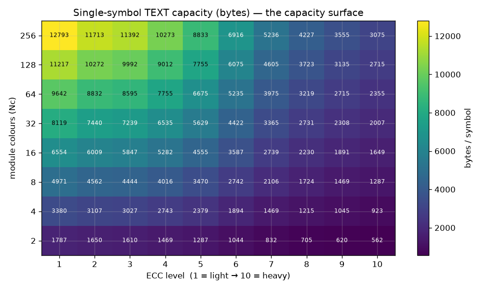

Single-symbol **text** capacity across the two knobs that set it: colour mode (Nc)
and ECC level. This is the canonical heatmap use-case — a *decision surface*. A brand
that needs "2 KB of provenance text surviving ECC level 5" reads off the cell.

**The headline:** a single 256-colour JABCode holds **~12.6 KB** (binary) / **~12.8 KB**
(text) at ECC 1, falling to **~2.9 KB** at ECC 10. Text beats binary at every cell —
the mode-compression of the (now fully ISO-conformant) text encoder packing letters at
~5 bits vs 8 bits/byte.

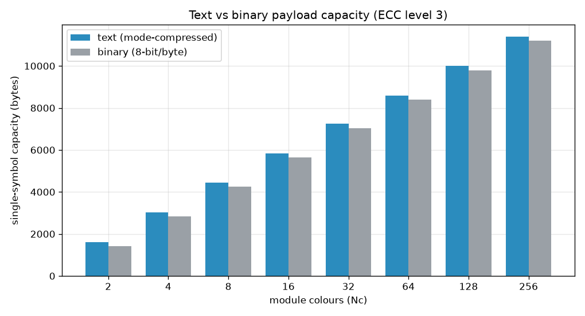

### The Wikipedia article test

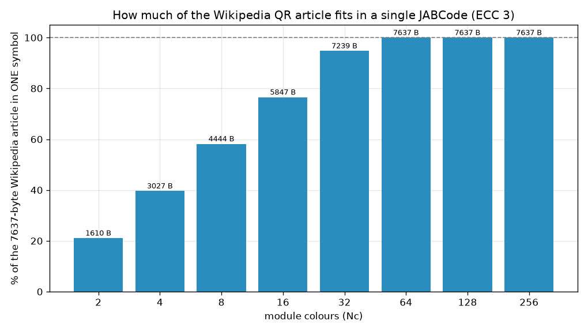

The **entire 7,637-byte Wikipedia QR-code article fits in ONE 64-colour JABCode** (100%),
and the symbol keeps shrinking with more colours (145 → 121 modules at 256-colour). At
8-colour, 58% of the article fits in a single symbol. This doubles as a large-scale
**conformance** test — the article round-trips byte-identical through the text modes.

### Density vs QR

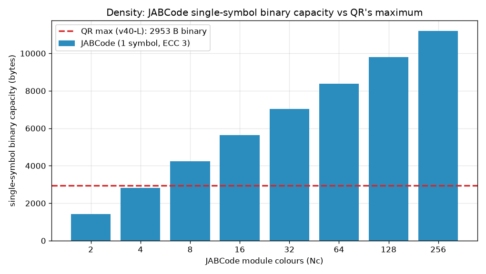

QR's maximum is **2,953 bytes** (binary, version 40, ECC level L — per the article itself).
A single JABCode passes that at modest colour depth and reaches ~4× it at 256-colour —
the polychrome density advantage, quantified.

---

## 2 · Latency

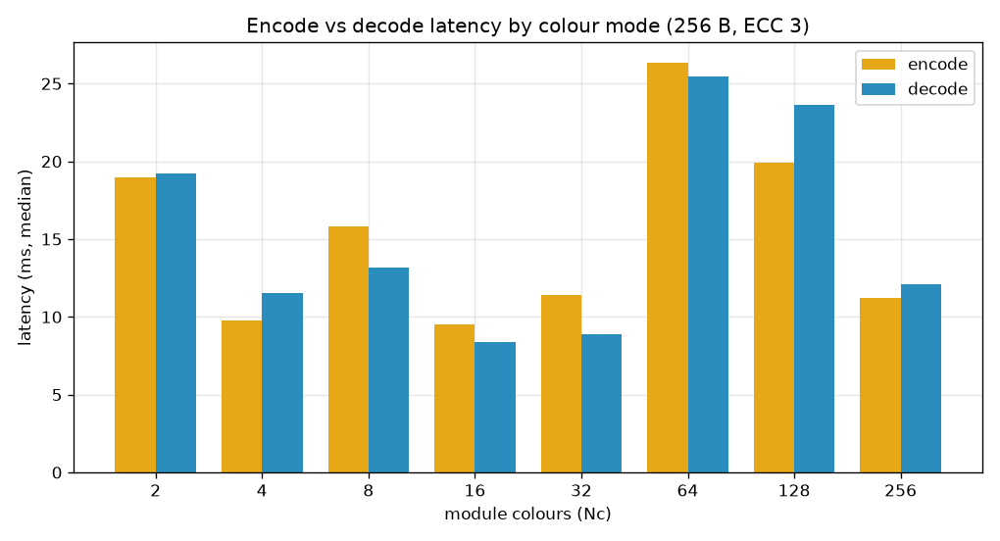

Encode and decode median latency by colour mode (256 B, ECC 3, x86_64 host). Decode
dominates (the LDPC + colour classification), and rises with colour depth.

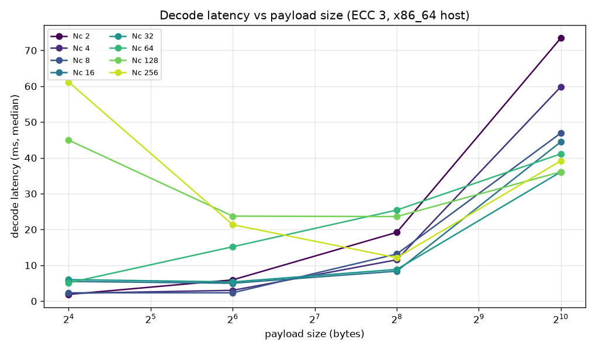

Decode latency vs payload size — the scaling the fixed-payload bench couldn't show.
(2-colour / Nc0 decode is unreliable on host beyond tiny payloads — a known pre-existing
Mode-0 limitation, surfaced honestly here as `dec_ok=0`.)

---

## 3 · The ECC tradeoff

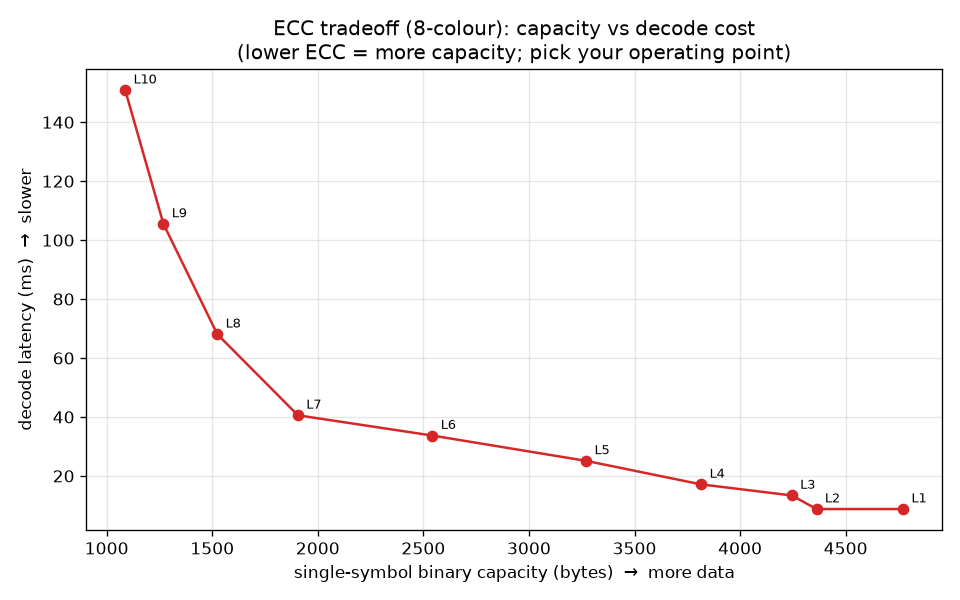

The robustness-vs-everything-else curve (8-colour). Climbing ECC 1→10 trades capacity
(~4 KB → ~1 KB at this payload) **and** decode latency (~9 ms → ~150 ms) for error
resilience. The default level 3 sits where the curve is still cheap — the right knee for
the print-vs-screen two-medium posture.

---

## 4 · Transcode robustness (digital channel)

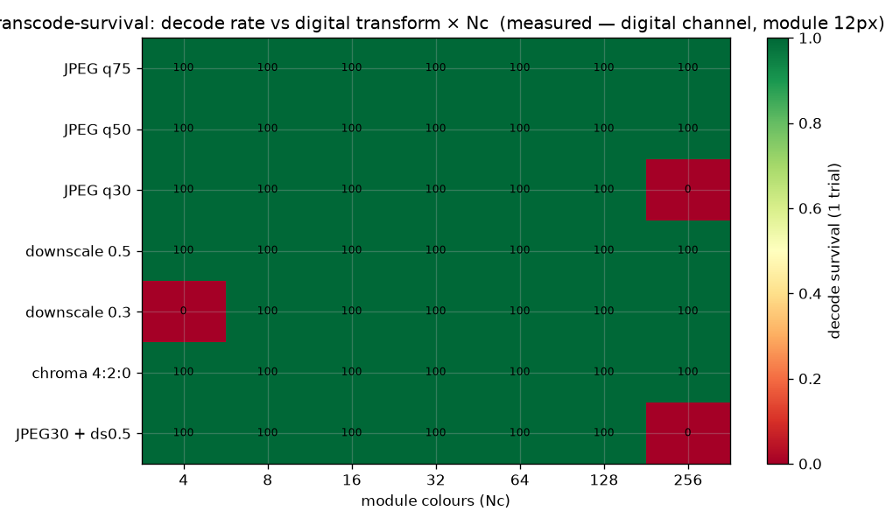

Decode survival after real digital transforms (JPEG recompress, downscale, 4:2:0 chroma)
applied via PIL, at module size 12 px. The honest result: **JABCode is robust** to
ordinary distribution transcoding across most colour modes; the failure modes are
**aggressive downscale** (sub-~4 px/module breaks even low-Nc) and **heavy JPEG on the
highest colour density** (256-colour fails q30, where colour quantization collapses the
palette). This is the *digital* channel — distinct from, and complementary to, the
optical/camera channel that the dedicated C2PA transcode-survival spike owns.

---

## 5 · End-to-end verification budget (scaffold)

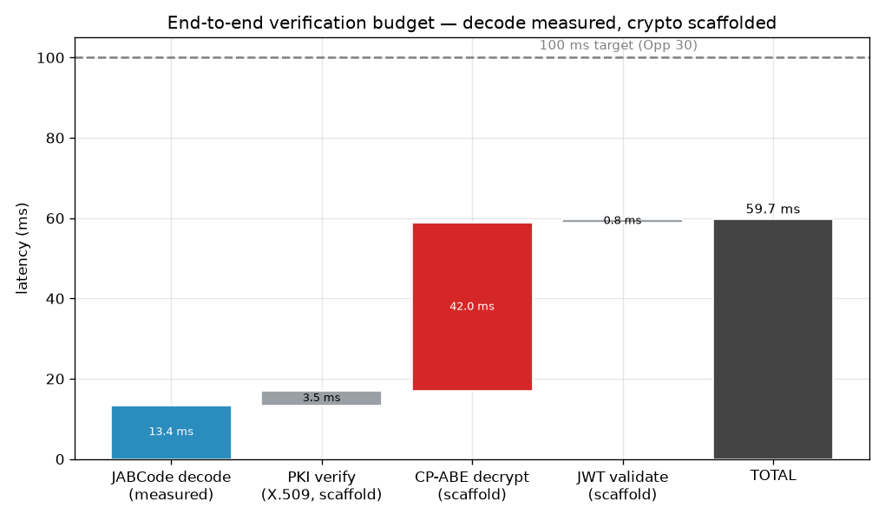

The strategic headline metric — does the SDK keep its "sub-100 ms verification" promise
(ecosystem report Opp 30)? **Decode is measured**; the PKI-verify / CP-ABE-decrypt /
JWT-validate stages are **placeholders** pending wiring of the `jab-auth` crypto module
benchmarks. The frame is the deliverable: a per-component budget against the 100 ms line,
ready to be filled with real `jab-auth-pki/abe/jwt` numbers.

---

## 6 · Comparative — JABCode vs QR (zxing-cpp)

A head-to-head against the incumbent, measured the same way: QR generated with `segno`,
decoded and timed with **zxing-cpp** (the actual library), same payloads, same PIL
transcode transforms. Deliberately honest — it shows where JABCode **loses**.

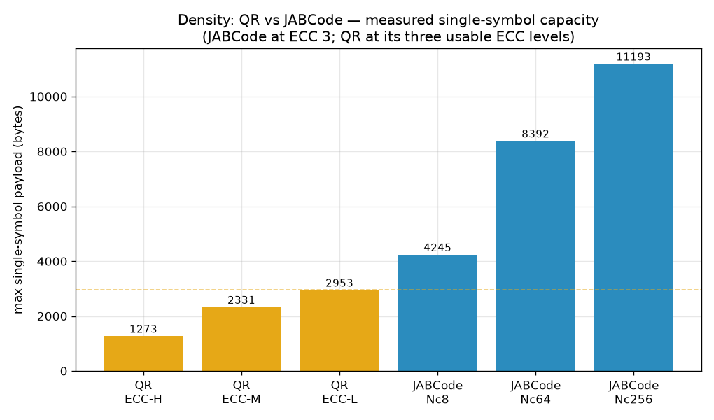
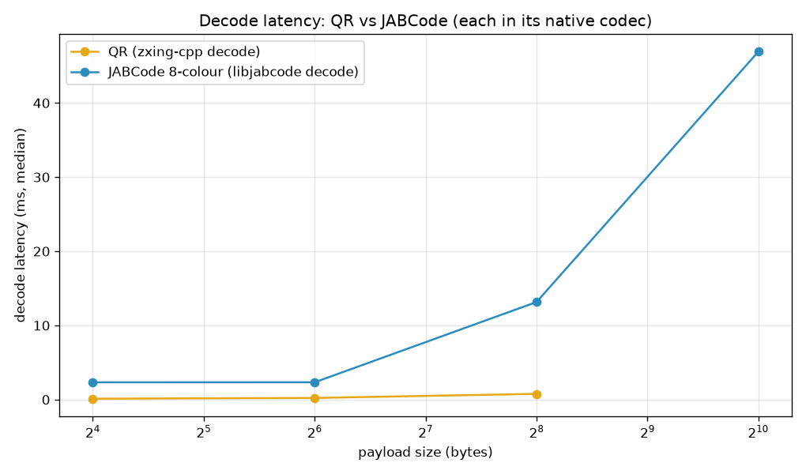
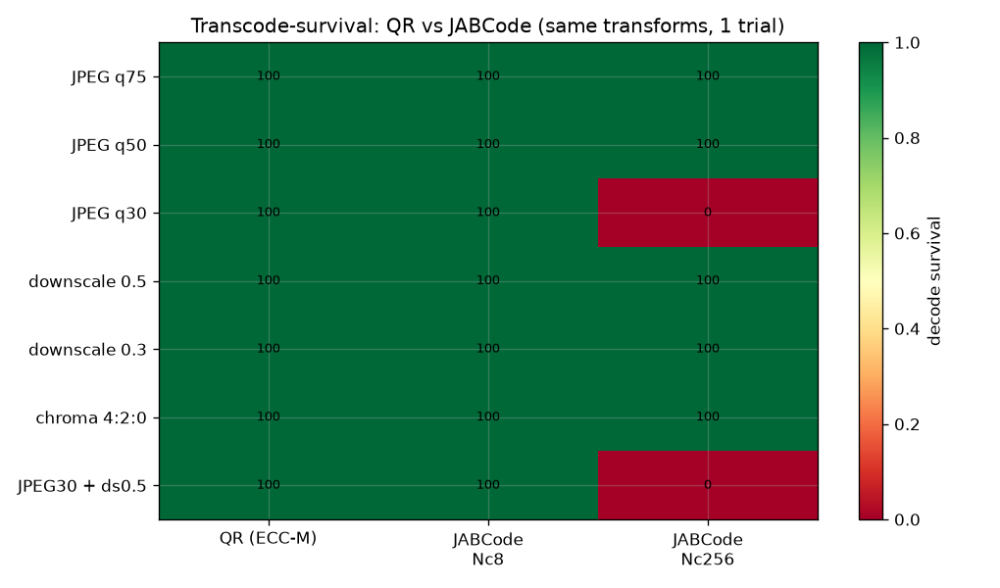

| Axis | QR (zxing-cpp) | JABCode | Winner |
|---|---|---|---|
| **Density** (max 1 symbol) | 2,953 B (ECC-L) | 11,193 B (Nc256, ECC3) / 12,594 B (ECC1) | **JABCode ~4×** |
| **Decode latency** (64 B) | 0.22 ms | 2.33 ms (8-colour) | **QR ~10×** |
| **Transcode-survival** | survives all transforms | cliffs at aggressive downscale / high-Nc heavy JPEG | **QR** |

**The honest read:** JABCode owns **density** — and the axis no monochrome code can
touch: multi-layer CP-ABE, crypto-bound, offline-verifiable payload. QR owns **speed,
robustness, and ubiquity**. JABCode is not a "faster, tougher QR"; it is the
*high-density, multi-layer, cryptographic* option, and the data says so plainly.

**A second reveal:** part of QR's latency/robustness lead is **reader maturity** —
zxing-cpp is a decade-hardened, sub-pixel-tolerant C++ reader, while the JABCode
reference decoder is research-grade C. That is exactly the gap a **JABCode port into
zxing-cpp** would close — making this comparison itself an argument for the collaboration.

---

## Key findings

- **Capacity:** up to ~12.6 KB in one 256-colour symbol (ECC 1); the whole Wikipedia
  article in one 64-colour symbol; ~4× QR's maximum at high colour depth.
- **Text > binary** at every operating point (mode compression).
- **ECC is the dominant latency *and* capacity knob** — far more than colour mode.
- **Transcode-robust** at sane module sizes; cliffs only at extreme downscale or
  high-colour heavy JPEG.
- **Conformance dividend:** these are the codec's numbers *as a fully ISO/IEC 23634
  decoder* — the same artifact that anchors the standards-credibility narrative.
- **vs QR (zxing-cpp):** JABCode wins density ~4× (11.2 KB vs 2.95 KB); QR wins decode
  latency ~10× (0.22 ms vs 2.33 ms @ 64 B) and survives more transcoding. JABCode's niche
  is density + multi-layer crypto — *not* speed/robustness — and part of QR's lead is
  reader maturity, the gap a zxing-cpp JABCode port would close.
