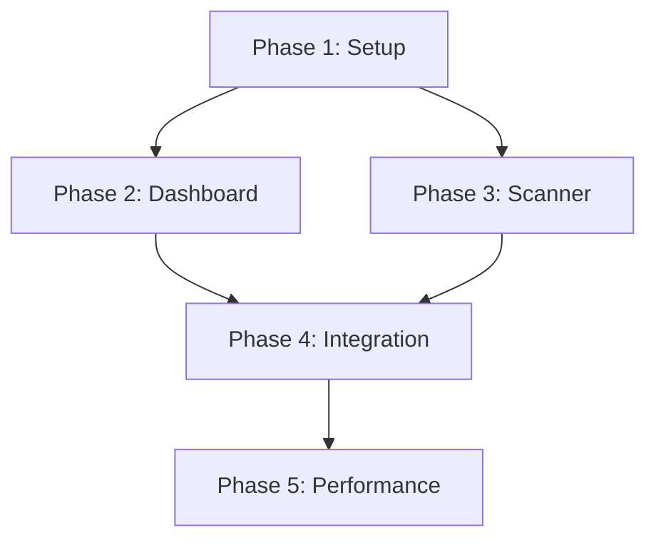

# JABAuth Diagnostic Application - Implementation Plan

**Project:** JABAuth Diagnostic App (Android)  
**Version:** 1.0.0  
**Date:** 2026-05-02  
**Status:** 📋 Planning

---

## Executive Summary

This document provides an **incremental implementation plan** for the JABAuth Diagnostic Application, built on top of the framework modules (:core, :jabcode-sdk, :jabauth-client, :diagnostic-engine, :ui-components).

**Prerequisites:** Framework Implementation Plan complete (6 modules)

**Key Objectives:**
1. Implement diagnostic dashboard UI from `diagnostic-dashboard.html`
2. Implement scanner UI from `scanner-interface.html`
3. Integrate all framework modules
4. Provide comprehensive testing and debugging tools
5. Ship production-ready diagnostic app

**Timeline:** 3-4 weeks (15-20 working days)

---

## Application Architecture

```
DiagnosticApp (:diagnostic-app module)
├── UI Layer (Jetpack Compose)
│   ├── DashboardScreen
│   ├── ScannerScreen
│   ├── SettingsScreen
│   └── ResultDetailScreen
├── ViewModel Layer
│   ├── DashboardViewModel
│   ├── ScannerViewModel
│   └── SettingsViewModel
├── Domain Layer
│   ├── Use Cases
│   └── Repository Interfaces
└── Data Layer
    └── Framework Module Integration
```

---

## Implementation Phases

### **Phase 1: Project Setup & Design System** → [Phase 1 Deep Dive](./diagnostic-app/phase1-setup.md)
**Duration:** 3 days  
**Focus:** App shell, navigation, theme implementation

**Deliverables:**
- Application module setup
- Navigation graph (3 screens)
- JABAuthTheme implementation with context variants
- Material 3 color scheme
- **Tests:** 5 navigation tests, 80%+ coverage

---

### **Phase 2: Dashboard Screen** → [Phase 2 Deep Dive](./diagnostic-app/phase2-dashboard.md)
**Duration:** 5 days  
**Focus:** Dashboard UI matching `diagnostic-dashboard.html`

**Deliverables:**
- Dashboard header with live metrics
- Color mode comparison cards (6 modes)
- Performance graph with animated bars
- Live benchmark feed
- Issue detection alerts
- Framework module health monitor
- **Tests:** 10 screenshot tests + 5 interaction tests, 75%+ coverage

---

### **Phase 3: Scanner Screen** → [Phase 3 Deep Dive](./diagnostic-app/phase3-scanner.md)
**Duration:** 5 days  
**Focus:** Scanner UI matching `scanner-interface.html`

**Deliverables:**
- Camera integration (CameraX)
- Scan target overlay with corner guides
- Quality indicators (brightness, focus, contrast)
- Scanning animation
- Result panel with authentication details
- Validation badges (PKI, JWT, ABE)
- **Tests:** 8 screenshot tests + 7 interaction tests, 75%+ coverage

---

### **Phase 4: Integration & E2E Testing** → [Phase 4 Deep Dive](./diagnostic-app/phase4-integration.md)
**Duration:** 4 days  
**Focus:** Full app integration and end-to-end testing

**Deliverables:**
- Complete user flows (Dashboard → Scanner → Results)
- Settings screen implementation
- Dependency injection setup (Hilt)
- E2E test suite
- **Tests:** 15 E2E tests, 80%+ overall coverage

---

### **Phase 5: Performance & Polish** → [Phase 5 Deep Dive](./diagnostic-app/phase5-performance.md)
**Duration:** 3 days  
**Focus:** Performance optimization, accessibility, final polish

**Deliverables:**
- Performance profiling and optimization
- Accessibility audit (TalkBack support)
- Animation polish
- Bug fixes
- **Tests:** 5 performance tests, final validation

---

## Test-Driven Development Strategy

### **Test Categories**

1. **Screenshot Tests** (Paparazzi)
   - Verify UI matches prototypes pixel-perfectly
   - Test all theme variants (Healthcare, Legal, IoT)
   - Test light/dark modes

2. **Interaction Tests** (Compose Testing)
   - User interactions (clicks, swipes, inputs)
   - Navigation flows
   - State changes

3. **E2E Tests** (Espresso + Compose)
   - Full user journeys
   - Integration between screens
   - Real device testing

4. **Performance Tests** (Macrobenchmark)
   - App startup time
   - Frame rate during scanning
   - Memory usage

### **Coverage Targets**

| Phase | Unit Tests | Integration | Screenshot | E2E | Target |
|-------|-----------|-------------|------------|-----|--------|
| Phase 1 | 5 | 0 | 0 | 0 | 80% |
| Phase 2 | 5 | 5 | 10 | 0 | 75% |
| Phase 3 | 7 | 7 | 8 | 0 | 75% |
| Phase 4 | 5 | 10 | 0 | 15 | 80% |
| Phase 5 | 0 | 0 | 0 | 5 | 80% |
| **TOTAL** | **22** | **22** | **18** | **20** | **80%** |

---

## User Flows

### **Flow 1: Performance Monitoring**
```
DashboardScreen
├── View live metrics (encode/decode times)
├── Compare color modes (4, 8, 16, 32, 64, 128)
├── Check framework module health
├── Review benchmark feed
└── See issue alerts
```

### **Flow 2: JABCode Scanning**
```
ScannerScreen
├── Open camera viewfinder
├── Position JABCode in target area
├── Monitor quality indicators
├── Wait for detection
├── View authentication results
│   ├── Certificate validation
│   ├── JWT token details
│   └── Scan quality metrics
└── Accept or scan again
```

### **Flow 3: Settings & Configuration**
```
SettingsScreen
├── Select color mode preference
├── Configure calibration profile
├── Set ECC level
├── Enable/disable diagnostics
└── View app info
```

---

## UI Component Mapping

**From Prototypes to App:**

| Prototype Component | App Screen | Compose Component |
|-------------------|-----------|-------------------|
| Live Metrics Bar | Dashboard | `MetricsBar()` |
| Color Mode Cards | Dashboard | `ColorModeGrid()` |
| Performance Graph | Dashboard | `PerformanceChart()` |
| Benchmark Feed | Dashboard | `LiveFeedList()` |
| Issue Alerts | Dashboard | `AlertSection()` |
| Scanner Header | Scanner | `ScannerHeader()` |
| Scan Target | Scanner | `ScanTargetOverlay()` |
| Quality Indicators | Scanner | `QualityIndicators()` |
| Result Panel | Scanner | `ResultBottomSheet()` |
| Validation Badges | Scanner | `ValidationBadges()` |

---

## Dependencies Between Phases



**Critical Path:** P1 → P2 → P4 → P5 (15 days)  
**Parallel Work:** P2 and P3 can overlap after P1

---

## Success Metrics

### **Functionality**
- ✅ Dashboard displays real-time metrics
- ✅ Scanner detects all 6 color modes
- ✅ Authentication validation works (PKI + JWT)
- ✅ Benchmark suite runs successfully
- ✅ Bug reports generate correctly

### **Quality**
- ✅ 82 tests pass (22 unit + 22 integration + 18 screenshot + 20 E2E)
- ✅ 80%+ overall coverage
- ✅ Zero critical bugs
- ✅ UI matches prototypes pixel-perfectly
- ✅ Accessibility score ≥ 90% (Lighthouse)

### **Performance**
- ✅ Cold start: ≤ 2s
- ✅ Dashboard render: ≤ 500ms
- ✅ Scanner frame rate: ≥ 30fps
- ✅ Memory: ≤ 50MB steady state
- ✅ APK size: ≤ 15MB

---

## Risk Mitigation

| Risk | Impact | Mitigation |
|------|--------|-----------|
| **Camera permissions** | High | Graceful fallback, clear permission prompts |
| **Performance on low-end devices** | Medium | Benchmarking on Pixel 3/4, performance profiling |
| **UI complexity** | Medium | Follow prototypes exactly, incremental implementation |
| **Integration issues** | Medium | Early E2E tests, continuous integration testing |

---

## Phase Documents

1. **[Phase 1: Setup & Design System](./diagnostic-app/phase1-setup.md)** - App shell
2. **[Phase 2: Dashboard Screen](./diagnostic-app/phase2-dashboard.md)** - Main UI
3. **[Phase 3: Scanner Screen](./diagnostic-app/phase3-scanner.md)** - Camera scanning
4. **[Phase 4: Integration & Testing](./diagnostic-app/phase4-integration.md)** - E2E flows
5. **[Phase 5: Performance & Polish](./diagnostic-app/phase5-performance.md)** - Final touches

**Master Checklist:** [DIAGNOSTIC_APP_CHECKLIST.md](./diagnostic-app/DIAGNOSTIC_APP_CHECKLIST.md)

---

## References

- **Framework Plan:** [FRAMEWORK_IMPLEMENTATION_PLAN.md](./FRAMEWORK_IMPLEMENTATION_PLAN.md)
- **UI Prototypes:** `@/swift-java-wrapper/android/ui-prototypes/`
- **Dashboard Prototype:** `diagnostic-dashboard.html`
- **Scanner Prototype:** `scanner-interface.html`
- **Design System:** `DESIGN_SYSTEM.md`
- **Scanner Components:** `SCANNER_COMPONENTS.md`

---

**Last Updated:** 2026-05-02  
**Status:** 📋 Ready for Implementation (after framework complete)  
**Next Action:** Complete Framework Phase 1-6, then start App Phase 1
