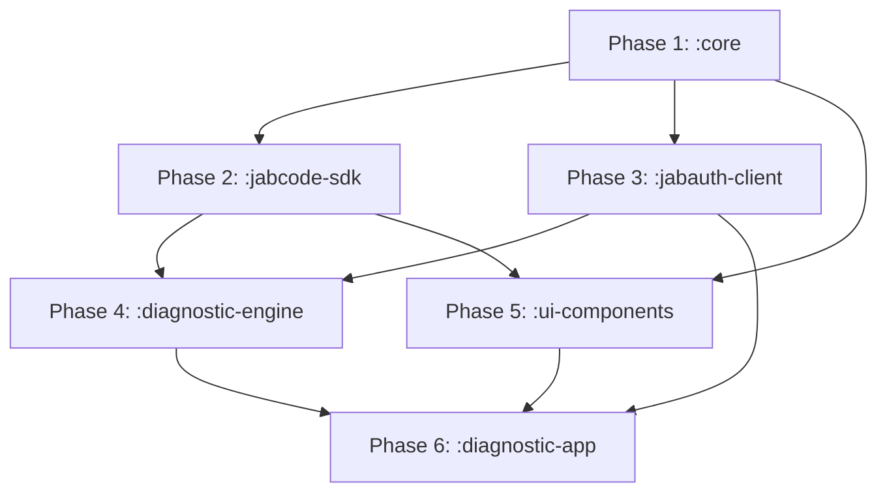

# JABAuth Framework Architecture - Implementation Plan

**Project:** JABAuth Mobile Framework (Android)  
**Version:** 1.0.0  
**Date:** 2026-05-02  
**Status:** 📋 Planning

---

## Executive Summary

This document provides an **incremental, phase-by-phase implementation plan** for the JABAuth Android framework, transforming the monolithic testapp into a modular diagnostic framework with 6 independent modules.

**Key Objectives:**
1. Create reusable libraries for JABAuth development
2. Enable custom app development (healthcare, legal, IoT)
3. Provide comprehensive diagnostic tools
4. Establish production-grade code quality (TDD, 80%+ coverage)

**Timeline:** 7-8 weeks (35-40 working days)

---

## Framework Modules

```
JABAuth Framework
├── :core                    // Foundation layer
├── :jabcode-sdk            // Native JABCode wrapper
├── :jabauth-client         // PKI/JWT/ABE validation
├── :diagnostic-engine      // Benchmark & testing
├── :ui-components          // Reusable UI (scanner, dashboard)
└── :diagnostic-app         // Final assembly
```

---

## Implementation Phases

### **Phase 1: Foundation (:core module)** → [Phase 1 Deep Dive](./framework-impl/phase1-core.md)
**Duration:** 1 week  
**Focus:** Storage, logging, validation, networking utilities

**Deliverables:**
- Secure storage abstraction (SharedPreferences + EncryptedFile)
- Structured logging with levels and tags
- Data validators (X.509, JWT, JSON)
- HTTP client wrapper (Retrofit/OkHttp)
- **Tests:** 25 unit tests, 80%+ coverage

---

### **Phase 2: Native SDK (:jabcode-sdk module)** → [Phase 2 Deep Dive](./framework-impl/phase2-jabcode-sdk.md)
**Duration:** 1 week  
**Focus:** JABCode encoding/decoding, calibration, performance

**Deliverables:**
- Kotlin API wrapping JABCodeMobile (C library)
- Color mode support (4, 8, 16, 32, 64, 128)
- Calibration profile manager
- Performance monitoring
- **Tests:** 35 unit tests (6 modes × 5 tests + utilities), 85%+ coverage

---

### **Phase 3: Authentication (:jabauth-client module)** → [Phase 3 Deep Dive](./framework-impl/phase3-jabauth-client.md)
**Duration:** 1.5 weeks  
**Focus:** PKI certificate validation, JWT parsing, ABE decryption

**Deliverables:**
- Certificate chain validator
- JWT parser with claims extraction
- ABE policy engine (mock/stub for now)
- Authentication result models
- **Tests:** 40 unit tests (PKI 15, JWT 15, ABE 10), 80%+ coverage

---

### **Phase 4: Diagnostics (:diagnostic-engine module)** → [Phase 4 Deep Dive](./framework-impl/phase4-diagnostic-engine.md)
**Duration:** 1.5 weeks  
**Focus:** Benchmark framework, performance tests, report generation

**Deliverables:**
- Benchmark suite for encode/decode
- Color mode comparison tests
- Performance metrics collector
- Bug report generator
- **Tests:** 30 unit tests + 6 integration tests, 75%+ coverage

---

### **Phase 5: UI Components (:ui-components module)** → [Phase 5 Deep Dive](./framework-impl/phase5-ui-components.md)
**Duration:** 2 weeks  
**Focus:** Reusable scanner & dashboard UI, design system

**Deliverables:**
- Scanner composables (7 components from SCANNER_COMPONENTS.md)
- Dashboard composables (cards, graphs, feeds)
- Theme system with context variants
- Animation utilities
- **Tests:** 25 screenshot tests + 15 interaction tests, 70%+ coverage

---

### **Phase 6: Diagnostic App (:diagnostic-app assembly)** → [Phase 6 Deep Dive](./framework-impl/phase6-diagnostic-app.md)
**Duration:** 1 week  
**Focus:** App integration, navigation, final testing

**Deliverables:**
- Navigation graph (Dashboard ↔ Scanner ↔ Settings)
- Dependency injection setup (Hilt/Koin)
- End-to-end tests
- Performance profiling
- **Tests:** 20 E2E tests, overall 80%+ coverage

---

## Implementation Strategy

### **Test-Driven Development (TDD)**

Every phase follows strict TDD:

1. **Write tests first** (unit + integration)
2. **Implement minimal code** to pass tests
3. **Refactor** for quality
4. **Run `/test-coverage-update` workflow** after phase completion
5. **Fix issues** until all tests pass with 80%+ coverage

### **Phase Completion Criteria**

Each phase is complete when:
- ✅ All unit tests pass
- ✅ All integration tests pass
- ✅ Code coverage ≥ 80% (unit), ≥ 70% (integration)
- ✅ No critical/high severity issues
- ✅ API documentation complete
- ✅ Migration guide written (if applicable)

### **Test Coverage Workflow**

After each phase:

```bash
# Run test-coverage-update workflow
# Prerequisites: JaCoCo configured, Mockito included

# 1. Run all tests
./gradlew test connectedAndroidTest

# 2. Generate coverage report
./gradlew jacocoTestReport

# 3. Review coverage
open build/reports/jacoco/test/html/index.html

# 4. Fix failures and iterate until:
# - All tests pass ✅
# - Coverage ≥ 80% ✅
# - No critical issues ✅
```

---

## Dependencies Between Phases



**Critical Path:** P1 → P2 → P4 → P6 (5.5 weeks)  
**Parallel Work:** P3 and P5 can run concurrently after P1

---

## Risk Mitigation

| Risk | Impact | Mitigation |
|------|--------|-----------|
| **Native library bugs** | High | Extensive unit tests on all color modes, synthetic decoder validation |
| **UI complexity** | Medium | Reference prototypes, incremental implementation, screenshot tests |
| **Test coverage gaps** | High | Mandatory 80% threshold, automated coverage checks after each phase |
| **Integration failures** | Medium | Early integration tests in Phase 4, E2E tests in Phase 6 |
| **Performance regressions** | Medium | Benchmark suite in Phase 4, continuous profiling |

---

## Success Metrics

**Code Quality:**
- ✅ 80%+ unit test coverage across all modules
- ✅ 70%+ integration test coverage
- ✅ Zero critical bugs in production code
- ✅ All public APIs documented

**Functionality:**
- ✅ 6 color modes working (4, 8, 16, 32, 64, 128)
- ✅ PKI + JWT validation functional
- ✅ Scanner UI matches prototype pixel-perfectly
- ✅ Diagnostic dashboard operational

**Performance:**
- ✅ Encode: ≤100ms (avg)
- ✅ Decode: ≤150ms (avg)
- ✅ App launch: ≤2s cold start
- ✅ Memory: ≤50MB steady state

---

## Phase Documents

Each phase has detailed documentation:

1. **[Phase 1: :core Module](./framework-impl/phase1-core.md)** - Foundation layer
2. **[Phase 2: :jabcode-sdk Module](./framework-impl/phase2-jabcode-sdk.md)** - Native wrapper
3. **[Phase 3: :jabauth-client Module](./framework-impl/phase3-jabauth-client.md)** - Authentication
4. **[Phase 4: :diagnostic-engine Module](./framework-impl/phase4-diagnostic-engine.md)** - Benchmarks
5. **[Phase 5: :ui-components Module](./framework-impl/phase5-ui-components.md)** - Reusable UI
6. **[Phase 6: :diagnostic-app Assembly](./framework-impl/phase6-diagnostic-app.md)** - Final integration

**Master Checklist:** [FRAMEWORK_CHECKLIST.md](./framework-impl/FRAMEWORK_CHECKLIST.md)

---

## References

- **Architecture:** [06-mobile-framework-architecture.md](./06-mobile-framework-architecture.md)
- **UI Prototypes:** `@/swift-java-wrapper/android/ui-prototypes/`
- **Design System:** `@/swift-java-wrapper/android/ui-prototypes/DESIGN_SYSTEM.md`
- **Scanner Components:** `@/swift-java-wrapper/android/ui-prototypes/SCANNER_COMPONENTS.md`
- **Android Refactoring:** `@/swift-java-wrapper/android/REFACTORING_ROADMAP.md`

---

**Last Updated:** 2026-05-02  
**Status:** 📋 Ready for Implementation  
**Next Action:** Review Phase 1 deep dive and start :core module
