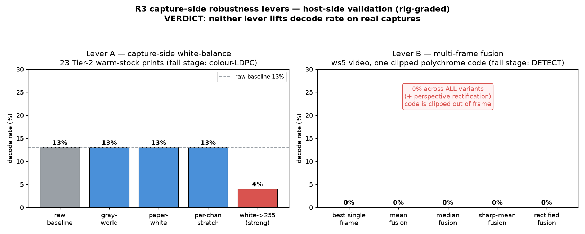

# R3 — Host-side validation of capture-side robustness levers

**Date:** 2026-06-18 · **Branch:** `claude/r3-capture-test` · **Rig:** R0 decode-rate rig (`robustness/r0/rig`)

## Question

R1 proved that **decode-side** colour fixes don't lift decode rate on real
captures (4 successive non-results; the decoder is adequate, robustness is an
encode-time choice). The open R3 hypothesis is the *other* half: that fixing
colour/geometry **at capture** — before the decoder ever runs — pays where
decode-side fixes didn't. This is the question to answer **before** any
mobile/Camera2 investment.

We tested the two capture-side levers offline, on captures we already have,
graded by the same R0 rig (in-process `decodeJABCodeEx` with
`strictPartIIRequired`, deepest-fail-stage attribution). **No decoded payloads
appear here — decode rates and fail-stages only.**

## Verdict (TL;DR)

**Neither capture-side lever lifts decode rate on real captures.**

| Lever | Input | Baseline | Best after | Δ |
|---|---|---:|---:|---:|
| **A — capture-side white-balance** | 23 Tier-2 warm-stock prints | 3/23 = **13%** | 3/23 = **13%** | **0** |
| **B — multi-frame fusion** | ws5 video (1 printed code) | best single frame **0** | fused **0** | **0** |

→ **R3's levers do not pay.** The shipped **encode-side per-medium Nc/ECC
profiles (R1 ②, #95) remain the whole robustness story.** Capture-side colour
correction and multi-frame fusion should **not** be the basis for a
mobile-capture-pipeline build on this evidence. Recommendation detail in §4.



---

## 1 · Lever A — capture-side white-balance / cast-correction

**This is the CAPTURE-side WB — full-image, single per-channel gain, applied
ONCE before finder detection.** It models what a camera ISP / acquisition
pipeline does at capture time. It is **distinct** from the R1 decode-side lever
that R1 refuted: R1 re-balanced colour **per module inside the decoder, after
detection**, on the already-quantised palette. Here we neutralise the **raw
whole frame** using the scene/paper as the white reference and hand the decoder
a de-tinted image.

**Inputs:** 23 Tier-2 warm-stock prints, `/tmp/tier2-captures/png/*.png`
(4000x3000, 4c+8c). Read-only. Baseline = **3/23 = 13%**, and the 20 failures
are **all colour-LDPC** (`NONE:3, LDPC:20`) — they DETECT and classify the
palette fine; the colour error-correction is uncorrectable.

**Measured cast (justification):** every capture is uniformly warm —
mean **R/G ~ 1.06, B/G ~ 0.97**; estimated paper white point ~ **(232, 226, 212)**
(blue depressed ~20 levels). A real, consistent yellow tint.

**Four WB strategies tried** (`scripts/lever_a_awb.py`, `scripts/lever_a_awb_strong.py`):

| method | what it does | decode rate | fail-stage histogram |
|---|---|---:|---|
| raw baseline | — | **3/23 (13%)** | NONE:3, LDPC:20 |
| gray-world (luma-anchored) | scene-mean -> neutral, luma preserved | **3/23 (13%)** | NONE:3, LDPC:20 |
| paper-white (luma-anchored) | brightest 2% (paper) -> neutral, luma preserved | **3/23 (13%)** | NONE:3, **DETECT:4**, LDPC:16 |
| per-channel stretch | independent 1-99 pct -> 0-255 per channel | **3/23 (13%)** | NONE:3, DETECT:1, LDPC:19 |
| white->255 (aggressive, no luma preserve) | full Von-Kries white-point removal | **1/23 (4%)** (down) | NONE:1, DETECT:3, LDPC:19 |

**The exact same 3 images decode in every run** — WB moves *no* image across the
decode boundary. The aggressive variant *regressed* (broke 2 of the 3 that
worked). Conservative variants left the LDPC wall untouched; the more aggressive
ones started knocking previously-OK frames *backward* into DETECT.

**Why it fails (root cause):** the cast is **uniform**, so a global per-channel
gain shifts *all* palette colours together. It does **not** increase the
**inter-colour separation** (ΔE between adjacent palette entries) that the
colour-LDPC stage needs on warm stock. WB removes a tint the human eye dislikes;
it does not restore the chroma *margin* the decoder lost when the substrate
compressed the gamut. This is the same lesson as R1, now generalised: **WB is
the wrong tool for colour-LDPC margin regardless of where it's applied.**

Samples: `leverA-awb/samples/` (raw vs paper-white crop of a failing frame).

## 2 · Lever B — multi-frame fusion

**Input:** the ws5 video,
`jabauth-android/diagnostic-app/logs/ws5-capture-20260523_032554.mp4`
(1080x2340, 30 fps, 39 s, 2338 frames). Read from the PRIMARY checkout, never
written to.

**Finding that reframes the test:** the video is a **screen-recording of the
diagnostic app**, and the code only appears inside the app's **live camera
preview pane** (rows y~[372,961] of the portrait frame). It is a **polychrome
JABCode (>=4-colour; the `nc=1` manifest label is wrong — informational only),
printed on warm paper, photographed at a strong oblique (keystone) angle, and
the top of the code is CLIPPED out of the preview pane in every frame.** So the
capture is doubly-degraded (photo-of-print -> screen-recording-of-app) *and*
geometrically incomplete.

**Pipeline** (`scripts/lever_b_select.py`, `lever_b_fuse.py`, `lever_b_rectify.py`):

1. Extract 117 frames @ 3 fps; crop the colourful preview band.
2. **Direct probe of all 117 single frames -> 0 decode.** 70 die at finder
   detection ("Too few finder pattern found"); **47 reach deeper** —
   "Sampling master symbol failed" (finders *are* found, but the keystone
   perspective + clipping defeat matrix sampling). Deepest reachable stage =
   **DETECT (matrix sampling)**, downstream of finder detection.
3. **Register** an in-focus cluster to its sharpest frame (OpenCV ECC, affine).
4. **Fuse**: mean, median, and sharpened-mean (unsharp on the mean).
5. Tested **two clusters**: an early in-focus cluster (f_024-f_045) and the
   **deep cluster f_103-f_112** (where finders are found — fusion's best case).
6. **Best-case assist:** perspective-**rectify** the fused images (detect the
   code quad, homography to a frontal square) at 512/768/1024 px.

**Results — fused vs best single frame:**

| variant | cluster | decode rate | fail stage |
|---|---|---:|---|
| best single registered frame | deep | **0** | DETECT |
| mean fusion | core / deep | **0 / 0** | DETECT |
| median fusion | core / deep | **0 / 0** | DETECT |
| sharpened-mean fusion | core / deep | **0 / 0** | DETECT |
| **rectified** fusion (median/sharpmean/single x 512/768/1024) | deep | **0/9** | DETECT |

**Fusion does not beat single-frame — both are 0.** All 8-9 frames per cluster
registered (ECC converged); the rectifier produced clean frontal images
(`leverB-fusion/samples/sample_fused_rectified.png`). Fusion successfully
**denoised** (and sharpened-mean even raised Laplacian variance *above* the
single frame), yet still 0.

**Why it fails (root cause):** blur/noise is **not** the binding constraint —
**geometry is.** Fusion can denoise but **cannot reconstruct modules that were
never captured** (the clipped top of the code) and cannot undo a perspective the
decoder can't sample. Every frame shares the same oblique angle and the same
clip, so averaging them yields a cleaner version of an *incomplete, warped*
code. The honest read: **this particular capture is unrecoverable by any
post-processing** because it is missing data — which is itself the strongest
argument that the fix belongs at *acquisition* (frame the whole code, square-on,
in focus), i.e. a capture-UX guardrail, **not** an offline fusion algorithm.

## 3 · What this does and doesn't say

- It **does** say: offline colour-correction and offline multi-frame fusion, on
  the real captures we have, **add zero decode rate.** Two more capture-side
  non-results, consistent with R1's four decode-side non-results.
- It **does not** say a real-time capture *guardrail* is worthless — but the
  lever that would help (reject clipped/oblique/blurry frames at acquisition, prompt
  the user to re-frame) is a **UX/quality-gate**, not the colour/fusion
  signal-processing R3 was framed around. The two algorithmic levers themselves
  don't pay.

## 4 · Recommendation

1. **Do not build the R3 mobile capture pipeline around colour-correction or
   multi-frame fusion.** Both are refuted on real captures (Δ = 0).
2. **The shipped encode-side per-medium Nc/ECC profiles (R1 ②, #95) are the
   robustness story.** Robustness is an **encode-time** choice (pick Nc/ECC for
   the medium), confirmed now from *both* the decode side (R1) and the capture
   side (R3).
3. The only capture-side intervention with a plausible payoff is a thin
   **acquisition quality-gate** (whole-code-in-frame + square-on + in-focus
   before accepting a frame). That is cheap UX, not a signal-processing lever,
   and should be scoped as such — not as the "R3 capture pipeline."
4. **Get a clean Tier-3 capture corpus** (codes fully in frame, square-on,
   varied lighting) before any further capture-side work — the ws5 clip can't
   carry a fusion conclusion on its own, and even with that caveat the colour
   lever is dead on 23 real prints.

## 5 · Reproduce

```
cd robustness/r0/rig && make all          # build libjabcode + r0_decode probe
# Lever A:
python3 ../../r3-test/scripts/lever_a_awb.py --indir /tmp/tier2-captures/png \
    --outdir /tmp/awb-pw --method paper-white \
    --manifest /tmp/m.jsonl --conditions tier2-awb-paperwhite
./run.sh /tmp/m.jsonl conditions
# Lever B: extract @3fps, score, fuse a cluster, rectify, grade (see scripts/).
python3 ../../r3-test/scripts/make_chart.py   # charts/r3_verdict.png
```

Manifests: `manifests/`. Per-image + aggregate JSON: `results/` (copied here, self-contained).
Samples: `leverA-awb/samples/`, `leverB-fusion/samples/`. The full fused/rectified
working-images (`leverB-fusion/fused/`, `leverB-fusion/rectified/`, ~12 MB) are
gitignored — regenerate via `scripts/lever_b_fuse.py` + `lever_b_rectify.py`.
